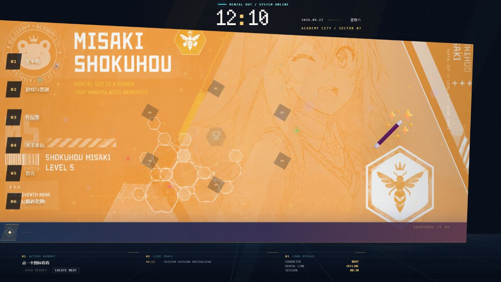
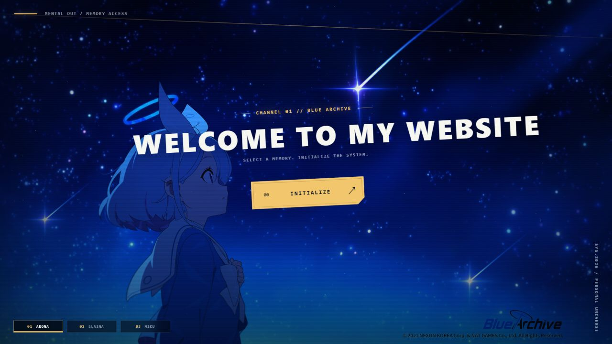

# PaperFrame Personal Website V2.0

纸帧（PaperFrame）的第二版个人网站。它不是普通的纵向作品集，而是一套可以探索的桌面界面：访客从进入页启动系统，再通过窗口、记忆网络和桌面角色查看站长信息与作品。



## 可以体验什么

- 六个主要区域：关于我、游戏与番剧、作品集、关于本站、留言、最近在做。
- 桌面窗口、开始菜单、任务栏、命令终端和记忆网络。
- 成就与彩蛋系统，完成核心成就后生成带二维码的数字访问票。
- 中文 / English 切换、音效开关和沉浸模式。
- 食蜂操祈 VRM 桌面角色、动作与 Mental Link 聊天入口。

V1.0 由本人手工编写；V2.0 在原项目上使用 AI Agent 辅助重构。角色动作通过 [VRMA Lab](https://github.com/YuBan834/vrma-lab) 调整后接入网站。



## 本地运行

需要 Node.js 20 或更高版本。

```bash
npm ci
npm run check
npm run dev
```

默认地址为 `http://127.0.0.1:8080`。

## 配置

复制 `.env.example`，在服务器环境变量中填写所需配置。不要提交 API Key、票券签名密钥、留言记录或 `.private` 目录。

聊天系统当前使用 `deepseek-v4-flash`。正式部署前，应撤销任何曾出现在聊天、截图或日志中的旧 Key，再生成新 Key。

## 第三方角色资源

仓库不包含 `shokuhou.vrm` 和 `assets/animations/character/` 下的动作文件。

现用食蜂操祈 VRM 模型由 `のーり` 制作，其内嵌许可禁止再分发。本地运行角色系统时，请自行取得合法副本并放到项目根目录；公开部署前应另外取得授权或替换模型。动作文件也应在确认各自许可后放入 `assets/animations/character/`。

详细说明见 [`assets/animations/THIRD_PARTY_NOTICES.md`](assets/animations/THIRD_PARTY_NOTICES.md)。

## 部署

生产环境推荐由 Nginx 处理 HTTPS 和静态请求，Node 服务只监听本机端口。完整步骤见 [`docs/服务器部署.md`](docs/服务器部署.md)。

## 相关项目

- [PaperFrame Website V1](https://github.com/YuBan834/paperframe-website-v1)
- [VRMA Lab](https://github.com/YuBan834/vrma-lab)
- [Star Focus](https://github.com/YuBan834/star-focus)

